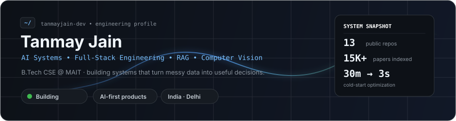
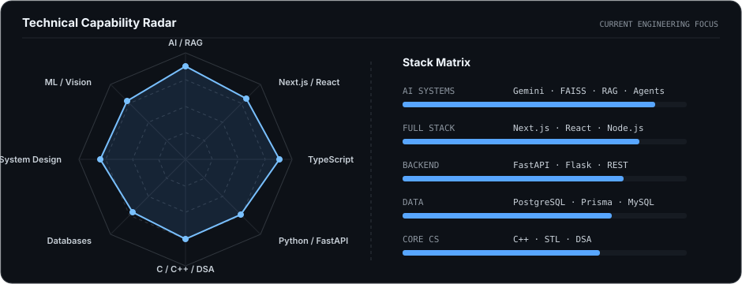
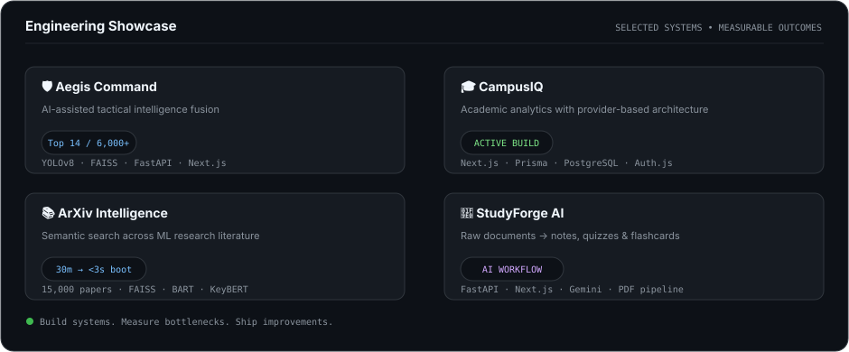

  

  
  
  

---

## `whoami`

I build **AI-powered systems and full-stack products** around a simple engineering question: *can a messy real-world workflow be turned into a system that is faster, clearer, and more useful?*

That has led me from **semantic search across 15,000 research papers** to **edge-aware computer-vision intelligence**, academic analytics, agentic workflows, and AI tools for learning.

- 🛡️ **Hackathon:** Team Lead — **#14 out of 2,000+ global participants** at HackerRank Infinity Hacks 2026
- 🎓 **Education:** B.Tech CSE, Maharaja Agrasen Institute of Technology
- ⚙️ **Current obsession:** AI systems, retrieval pipelines, backend architecture and shipping things that actually work
- 🤝 **Open to:** ambitious builds, hackathons, AI/ML engineering and full-stack collaboration

---

  

---

## Selected Systems

  

### 🛡️ [Aegis Command](https://github.com/TanmayJain-dev/Aegis-Command)
**AI-assisted tactical intelligence fusion for fragmented operational data.**

Built around edge vision, SIGINT retrieval and grounded LLM summaries. The system combines **YOLOv8, FAISS, FastAPI and Next.js** into a single situational-awareness workflow. **#14 / 2,000+ globally.**

### 🎓 [CampusIQ](https://github.com/TanmayJain-dev/CampusIQ)
**An academic analytics platform designed to make university results usable.**

Provider-based university integrations, synchronization infrastructure and a scalable architecture built with **Next.js, TypeScript, Prisma, PostgreSQL and Auth.js**.

### 📚 [ArXiv Paper Intelligence System](https://github.com/TanmayJain-dev/ArXiv-Paper-Intelligence-System)
**Semantic search and research intelligence over 15,000 machine-learning papers.**

A cached FAISS pipeline reduced system boot time from **~30 minutes to under 3 seconds**, with BART summarization and KeyBERT extraction layered on top.

### 🧠 [StudyForge AI](https://github.com/TanmayJain-dev/StudyForge-AI)
**Document intelligence for students.**

Transforms raw study material into structured notes, active-recall flashcards, quizzes and revision sheets using **FastAPI, Next.js and Gemini-powered workflows**.

---

## Toolbelt

---

## GitHub Telemetry

  
  

---

## Beyond the terminal

I like projects where **the technical problem is only half the problem**. The other half is figuring out whether the system survives real users, bad inputs, ugly constraints and the inevitable *“wait, what happens if...?”*.

Currently learning deeper **DSA, system design and production AI engineering** while continuing to build.

Build something ambitious. Then make it survive reality.

